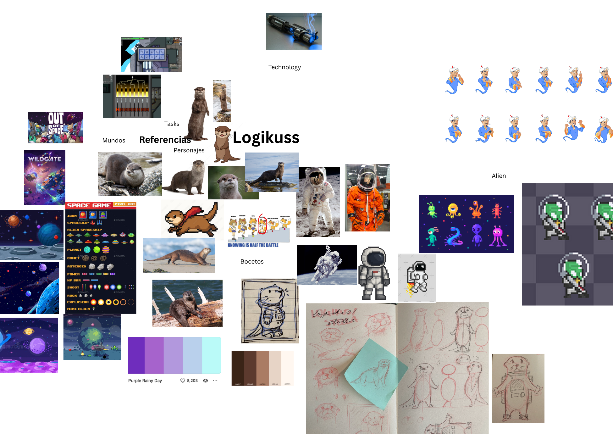
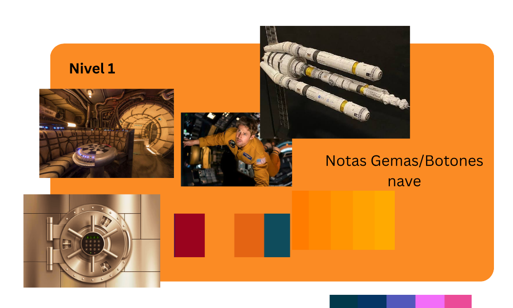
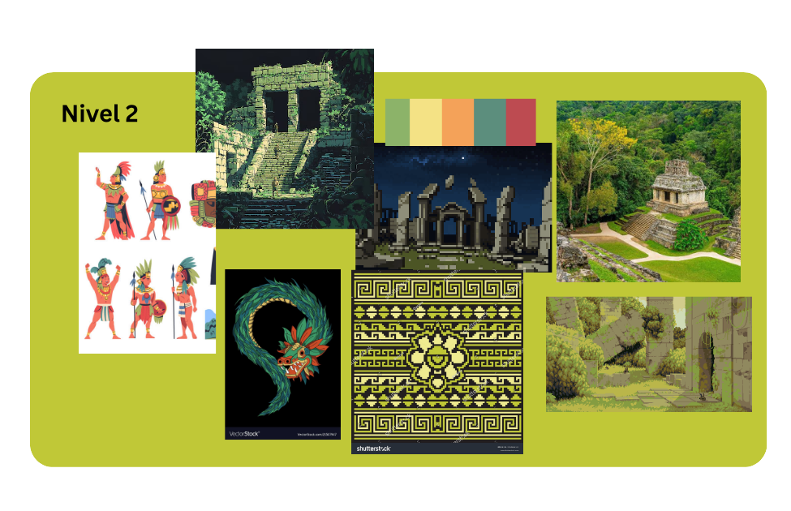
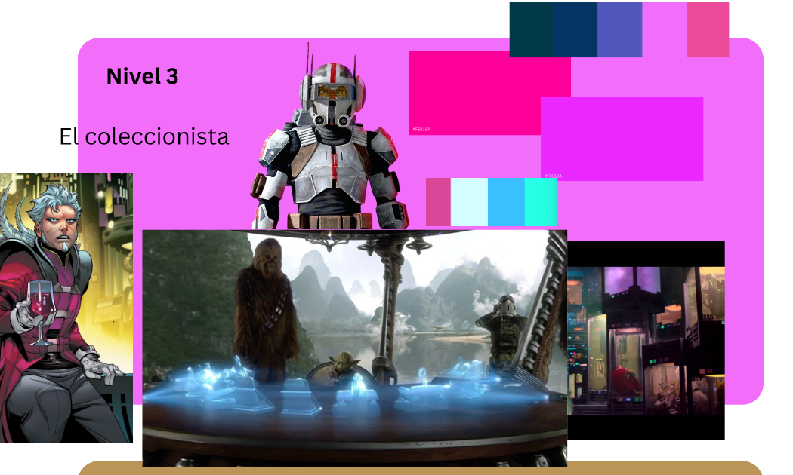
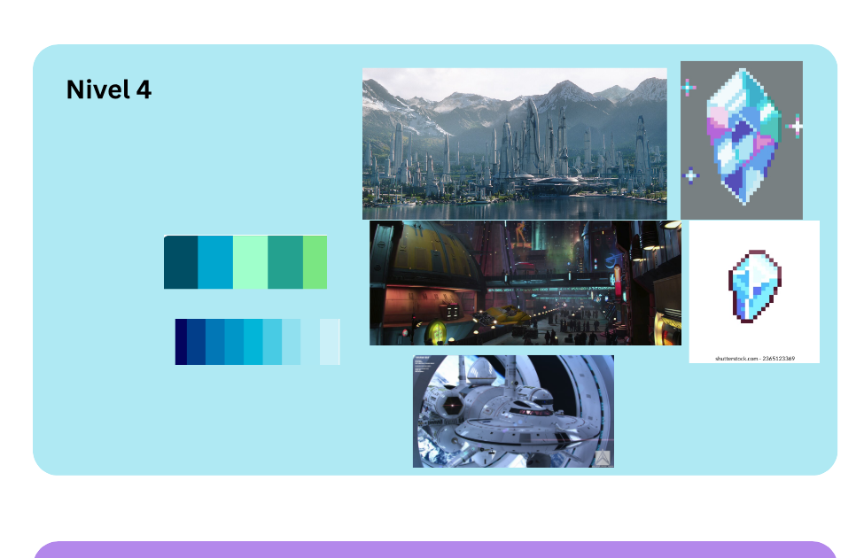
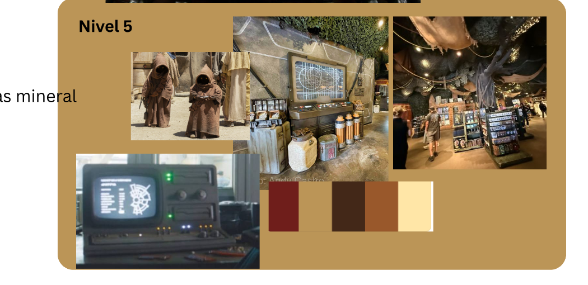
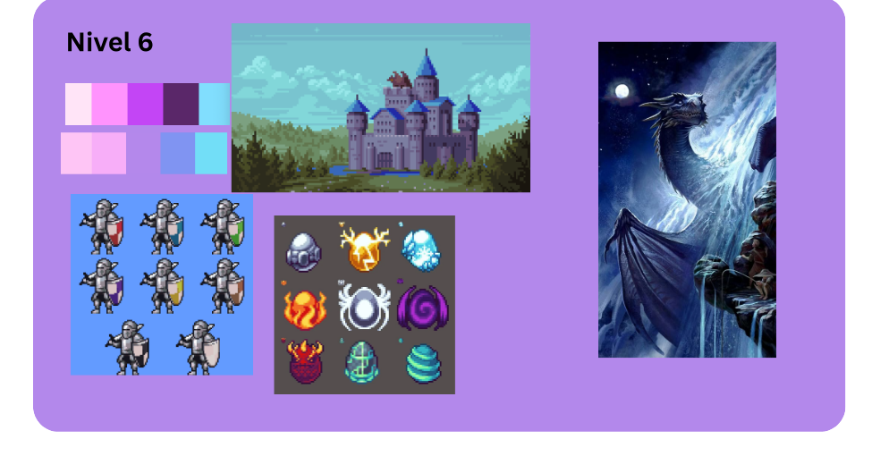

# Placeholder Inventory

Every implemented level currently uses plain Unity UI shapes and colours instead of
final art. This page lists what each placeholder element is standing in for, now
matched against the actual moodboard references (from `Logikuss.svg`, exported as
PNGs under [`references/`](references/) since the source SVG is ~66 MB and isn't
checked into git).

Nothing here blocks gameplay — every placeholder is already wired to real game logic
and game state. Replacing one is a visual-only change.

## Shared across every level — Stella

- **`StellaFace`** (top-left corner of every level) — currently a plain coloured
  square labelled "STELLA". References show Stella as an **otter in an astronaut
  suit**, with sketches of just her head/upper body poking out of the helmet —
  that framing (otter face inside a round helmet opening) is probably the right
  shape for this corner portrait. The reference sheet of a 12-pose reaction grid
  (different poses/expressions per cell) is a good template for how to organize a
  Stella expression sheet (idle, thinking, happy, worried, etc.) once it's drawn.
- Note: the placeholder box is currently blue. The moodboard's astronaut-suit
  reference is **mustard/orange**, not blue — worth confirming which is Stella's
  actual suit colour before producing final art.
- The project is branded "Logikuss" on this moodboard. Everything in code and docs
  currently says "Stella" (the character's name) — just flagging the "Logikuss"
  name in case it matters for branding/title screens later, not changing anything.

## Level 1 — Double Lock

- **`CombinationRegion` background** — the reference is a literal **bank vault
  door with a rotary combination dial**, not a generic sci-fi panel. That's a much
  more specific target than what the current flat panel suggests.
- **Ship interior** — a round bridge/control-room reference (glowing central
  console) for the station/archive environment framing the vault door.
- **`GuessSlot_1..4` / `ColourButton_*`** — the moodboard note says "Notas
  Gemas/Botones nave" (gem notes / ship buttons), suggesting the gem buttons might
  read more like **physical ship control buttons** than loose gem jewels.
- Palette reference: maroon red, orange, teal, orange→yellow gradient.

## Level 2 — The Ruins Board

Matches the design doc's Palenque-inspired direction closely: Mayan/Aztec temple
ruins (including a glowing night-time pixel-art version), a feathered-serpent
(Quetzalcoatl) motif, warrior character art, and an ornate gold-on-black geometric
carving pattern that could work as a board or border texture. Palette: sage green,
cream, peach, teal, maroon.

## Level 3 — The Collector

- **The Collector (character)** — two alternate directions in the references: a
  silver/white armoured robotic figure, or an aristocratic comic-book villain in
  red holding a wine glass. Worth picking one before concepting the character.
- **`HolographicTable` / `TokenPanel`** — the key reference is a **Star Wars-style
  holotable**: glowing blue translucent 3D shapes projected above a table surface.
  This is a much stronger, more specific direction than the current flat purple
  square, and would also solve the "the level feels too abstract" feedback from
  testing — a glowing holographic marker on a projected mini-grid would show the
  token's position visually instead of only as `(row, column)` text.
- Palette: magenta, purple, cyan/teal, pink.

## Level 4 — The Krik Greeting

- **Crystal sprites** — two pixel-art faceted gem icon references (teal/purple/pink,
  and blue/white) are a direct, ready-to-use style target for the 20 energy
  crystal sprites.
- **Environment** — a futuristic city of spires among snow-capped mountains
  matches the design doc's "cold, high-technology Krik environment."
- Palette: teal→green gradient, navy→light blue gradient.

## Level 5 — The 200 Gems

- **Guardian / market figures** — small hooded, robed alien traders (Jawa-style)
  match the design doc's "robed figures" note directly.
- **Inventory display** — an old CRT terminal with green text and physical knobs
  is a direct reference for the "old terminal or LED-like inventory display" the
  design doc asks for.
- **Gems** — labelled "Monedas mineral" (mineral coins) on the moodboard, backing
  up the design doc's "treat the gems as mineral coins or catalogued offerings."
- Palette: maroon, dark brown, caramel, cream.

## Level 6 — Galactic Customs

- **`Egg_1..27`** — a 3×3 grid of pixel-art egg icons with very different patterns
  (metal, lightning, ice, fire, spiky, swirl, stripes) shows the intended egg
  *style*, but the rules require all 27 meteor eggs to look **identical** so the
  stowaway isn't visible by sight — final art should likely pick one of these
  designs and repeat it 27 times, not mix all of them.
- The pixel-art castle and the knight-icon grid in this section don't obviously
  match a customs-satellite setting — possibly general style references rather
  than level-specific ones. Worth confirming with whoever built this board.
- Palette: pink, magenta, purple, dark purple, cyan.

## Suggested order

1. Stella's portrait/expression set (reused in every level — biggest leverage).
2. Level 3's holographic token/mini-grid (currently the least intuitive placeholder,
   and now has a concrete reference to build toward).
3. Level 1's vault door + gem/button art (most "finished-feeling" level otherwise).
4. The rest, in whatever order matches playtesting priority.
